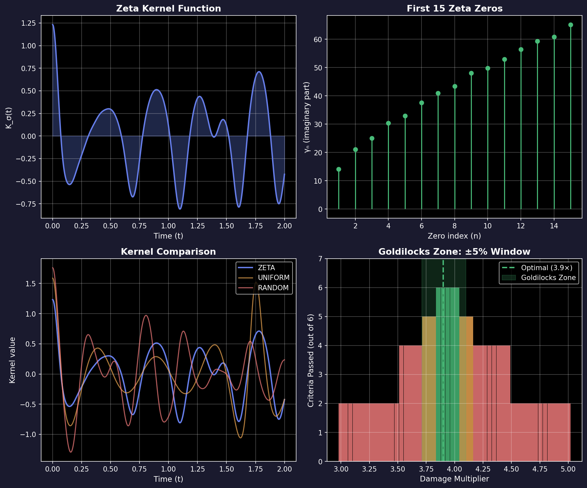

:html_theme.sidebar_secondary.remove:

.. raw:: html

   

   

       <h1>Zeta-Life</h1>
       
A research framework connecting Riemann zeta mathematics, multi-agent emergence, and computational identity

       

           93K+ Lines
           72 Experiments
           296 Tests
           6/6 IPUESA
       

       

           <a href="getting-started.html" class="hero-btn hero-btn-primary">Get Started</a>
           <a href="papers/zeta-life-framework-paper.html" class="hero-btn hero-btn-secondary">Read the Paper</a>
       

   

Zeta-Life Documentation
=======================

.. raw:: html

   

       

           <h3><a href="getting-started.html">Getting Started</a></h3>
           
New to Zeta-Life? Start here for installation, basic concepts, and your first experiments with zeta-weighted kernels.

       

       

           <h3><a href="papers/zeta-life-framework-paper.html">Research Paper</a></h3>
           
The complete scientific paper with theoretical foundations, methodology, experimental results, and discussion.

       

       

           <h3><a href="EXPERIMENTS.html">Experiments</a></h3>
           
72 research scripts organized by domain: organism dynamics, consciousness, cellular automata, and validation.

       

       

           <h3><a href="api/modules.html">API Reference</a></h3>
           
Detailed documentation of all modules, classes, and functions in the zeta_life package.

       

   

Key Results
-----------

.. raw:: html

   

       

           
+134%

           
Cell survival vs Moore

       

       

           
11

           
Emergent properties

       

       

           
±5%

           
Goldilocks zone

       

       

           
6/6

           
IPUESA criteria

       

   

The Zeta Kernel
---------------

At the core of Zeta-Life is the **zeta kernel**, derived from non-trivial zeros of the Riemann zeta function:

.. math::

   K_\sigma(t) = 2 \sum_{n=1}^{M} e^{-\sigma |\gamma_n|} \cos(\gamma_n t)

where :math:`\gamma_n` are the imaginary parts of zeta zeros (14.134, 21.022, 25.010, ...).

Quick Install
-------------

.. code-block:: bash

   pip install -e ".[full]"
   python -m pytest tests/ -v

.. raw:: html

   

       <h3>Useful Links</h3>
       

           <a href="getting-started.html">Installation</a>
           <a href="https://github.com/fruizvillar/zeta-life">Source Repository</a>
           <a href="https://github.com/fruizvillar/zeta-life/issues">Issue Tracker</a>
           <a href="REPRODUCE.html">Reproduce Results</a>
           <a href="TROUBLESHOOTING.html">Troubleshooting</a>
           <a href="GOLDILOCKS_DISCOVERY.html">Goldilocks Zone</a>
       

   

.. toctree::
   :maxdepth: 1
   :caption: Guide
   :hidden:

   Getting Started <getting-started>
   Reproduce <REPRODUCE>
   Troubleshooting <TROUBLESHOOTING>

.. toctree::
   :maxdepth: 1
   :caption: Research
   :hidden:

   Paper <papers/zeta-life-framework-paper>
   IPUESA <papers/ipuesa-identidad-funcional-paper>

.. toctree::
   :maxdepth: 1
   :caption: Reference
   :hidden:

   Experiments <EXPERIMENTS>
   Theory <TEORIA_ZETA_EMERGENCIA>
   Goldilocks <GOLDILOCKS_DISCOVERY>
   API <api/modules>

Citation
--------

.. code-block:: bibtex

   @article{ruiz2026zetalife,
     title={Zeta-Life: A Unified Framework Connecting Riemann Zeta
            Mathematics, Multi-Agent Dynamics, and Functional Identity},
     author={Ruiz, Francisco},
     journal={arXiv preprint},
     year={2026}
   }

.. toctree::
   :hidden:

   GoL Docs <DOCUMENTACION>
