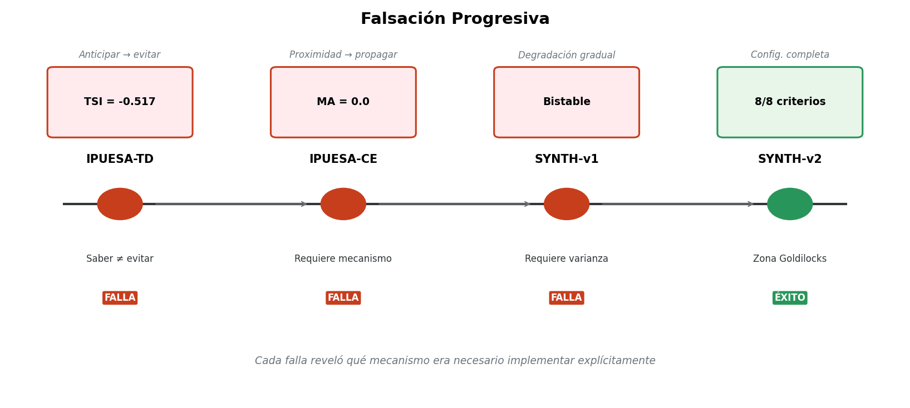
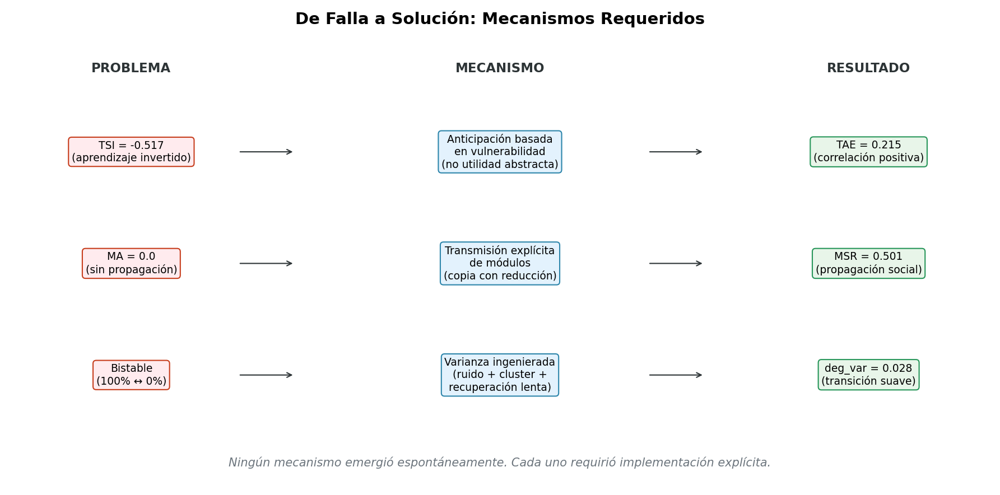
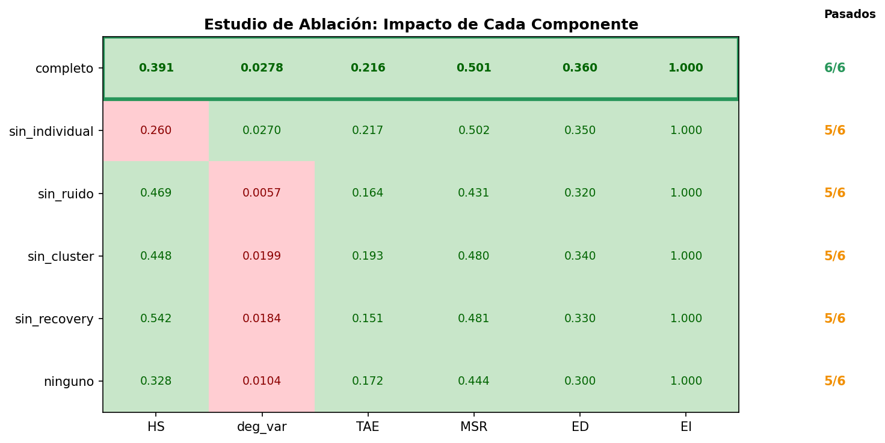
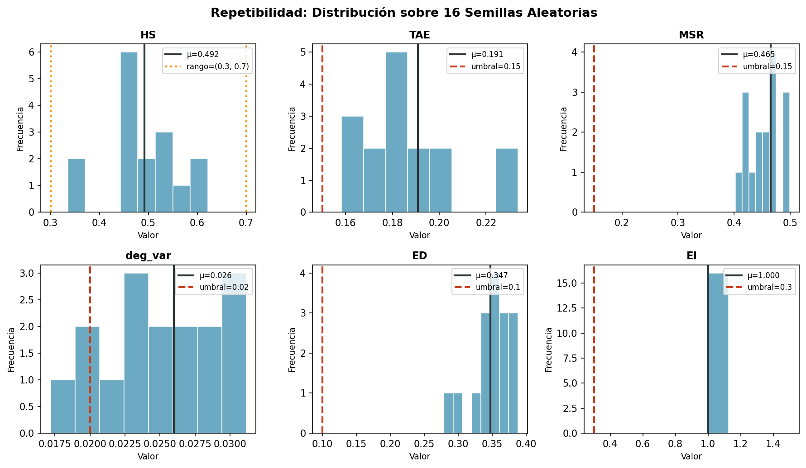

# Atractores de Identidad Funcional en Sistemas Multi-Agente: Qué Funciona, Qué Falla, y Por Qué Importa

**Resumen**

Investigamos si los sistemas multi-agente pueden exhibir identidad funcional auto-mantenida bajo estrés. En lugar de afirmar conciencia o emergencia espontánea, operacionalizamos "self" como un atractor medible caracterizado por anticipación, diferenciación y propagación social. A través de falsación progresiva, mostramos que los enfoques más simples fallan: el aprendizaje temporal se invierte (los agentes aumentan el riesgo cuando anticipan costo), la propagación social requiere mecanismos explícitos, y la degradación suave demanda varianza ingenierada. Nuestra configuración final (SYNTH-v2) logra 8/8 criterios de auto-evidencia, pero solo dentro de un régimen de estrés estrecho (3.9× ± 5%). Esta fragilidad no es una debilidad—es el resultado central. La identidad funcional tipo-self es alcanzable, pero no gratuita.

---

## 1. Introducción

El concepto de "self" en sistemas artificiales permanece frustrantemente vago. Las afirmaciones van desde emergencia de conciencia hasta mera persistencia de información, con poco acuerdo sobre qué constituiría evidencia para cualquiera de las dos.

Tomamos un enfoque diferente: en lugar de debatir fenomenología, hacemos una pregunta más simple:

> ¿Puede un sistema multi-agente mantener un atractor de identidad funcional bajo estrés—uno que anticipe amenazas, diferencie trayectorias individuales, y propague adaptaciones aprendidas socialmente?

Esto no es una afirmación sobre conciencia, experiencia, o estados subjetivos. Es una afirmación sobre propiedades funcionales medibles.

**Nuestra contribución es triple:**

1. Una definición operacional de "self" como atractor funcional, con seis métricas cuantificables
2. Un registro sistemático de qué falla: aprendizaje invertido, propagación ausente, colapso bistable
3. Una configuración mínima funcional que logra todos los criterios—pero solo dentro de un régimen calibrado

Enfatizamos temprano: **nada en este trabajo demuestra emergencia espontánea**. Cada componente exitoso requirió implementación explícita después de que versiones más simples fallaran. El valor no está en probar emergencia, sino en documentar precisamente qué es necesario para que aparezca comportamiento tipo-self.

---

## 2. Trabajo Relacionado

### 2.1 Auto-Modelos en IA

Los auto-modelos computacionales han sido explorados en robótica (Bongard et al., 2006) y redes neuronales (Schmidhuber, 2015). Estos típicamente se enfocan en auto-representación física más que en persistencia de identidad funcional bajo estrés.

### 2.2 Adaptación Multi-Agente

La adaptación colectiva en sistemas multi-agente ha sido estudiada extensivamente (Shoham & Leyton-Brown, 2008), pero usualmente enfatiza desempeño en tareas más que mantenimiento de identidad. Nuestro trabajo se enfoca en qué persiste cuando el sistema es dañado, no en qué logra.

### 2.3 Persistencia de Identidad

Los relatos filosóficos de identidad personal (Parfit, 1984) distinguen identidad numérica de cualitativa. Evitamos este debate definiendo identidad operacionalmente: un sistema tiene identidad funcional si satisface nuestras seis métricas bajo estrés.

Deliberadamente evitamos la literatura de conciencia (IIT, GWT, HOT) ya que nuestras afirmaciones no requieren ni implican experiencia fenoménica.

---

## 3. Definición Operacional

### 3.1 Lo que NO Afirmamos

| Concepto | Estado |
|----------|--------|
| Conciencia | No afirmado |
| Experiencia subjetiva | No afirmado |
| Qualia | No afirmado |
| Self fenoménico | No afirmado |
| Emergencia espontánea | No afirmado |

### 3.2 Lo que SÍ Operacionalizamos

**Atractor de Identidad Funcional**: Un patrón dinámico en un sistema multi-agente que satisface:

| Propiedad | Definición | Métrica | Umbral |
|-----------|------------|---------|--------|
| **Anticipación** | El sistema predice daño futuro y modifica comportamiento presente | TAE | > 0.15 |
| **Coherencia** | Integridad estructural preservada bajo estrés | EI | > 0.3 |
| **Propagación** | Aprendizaje individual se transmite socialmente | MSR | > 0.15 |
| **Diferenciación** | Los agentes desarrollan trayectorias distintas | ED | > 0.10 |
| **Gradualidad** | Transiciones suaves, no colapso binario | deg_var | > 0.02 |
| **Supervivencia calibrada** | Ni trivial ni imposible | HS | [0.30, 0.70] |

### 3.3 Definición de Métricas

**TAE (Efectividad de Anticipación Temporal)**
```
TAE = corr(threat_buffer[t], IC_drop[t:t+5])
```
Mide si la señal de anticipación del sistema correlaciona con el daño futuro real. Correlación positiva indica anticipación funcional.

**MSR (Tasa de Propagación de Módulos)**
```
MSR = módulos_aprendidos / módulos_totales
```
Mide transmisión social de adaptaciones. Un módulo es "aprendido" si se originó en otro agente.

**EI (Integridad de Embedding)**
```
EI = ||embedding|| / norma_max - penalidad_obsolescencia
```
Mide preservación de estructura holográfica que codifica identidad de cluster.

**ED (Diferenciación Emergente)**
```
ED = std(estados_supervivencia)
```
Mide varianza en resultados de agentes. Alto ED significa que los agentes no son masa uniforme.

**deg_var (Varianza de Degradación)**
```
deg_var = var(nivel_degradación)
```
Mide suavidad de transiciones. Bajo deg_var indica dinámica bistable (todo-o-nada).

**HS (Supervivencia Holográfica)**
```
HS = P(agente.está_vivo())
```
Proporción que sobrevive. Debe estar en zona Goldilocks—ni trivial (todos viven) ni imposible (todos mueren).

---

## 4. Falsación Progresiva

Esta sección documenta qué falló. Consideramos esto la contribución más importante, ya que revela qué es realmente necesario para la identidad funcional.


*Figura 2: Evolución de experimentos mostrando fallas sistemáticas y correcciones requeridas.*

### 4.1 IPUESA-TD: El Aprendizaje Temporal se Invierte

**Hipótesis**: Agentes que anticipan costo futuro reducirán comportamiento riesgoso.

**Implementación**: Función de utilidad `U = recompensa - λ × E[pérdida_futura] × γ^k`

**Resultado**: TSI = -0.517 (Índice de Estrategia Temporal)

**Interpretación**: Los agentes eligieron MÁS acciones riesgosas cuando el costo futuro era alto. La correlación fue significativamente negativa.

**Lección**: Saber el costo no implica evitarlo. Las funciones de utilidad abstractas no se traducen automáticamente en cambio de comportamiento. La anticipación debe modificar directamente parámetros conductuales, no meramente informar un cálculo.

### 4.2 IPUESA-CE: Propagación Social Ausente

**Hipótesis**: Los módulos se propagarán naturalmente entre agentes próximos.

**Implementación**: Módulos creados por agente con influencia basada en proximidad.

**Resultado**: MA = 0.0 (Tasa de Adopción de Módulos)

**Interpretación**: Cero transmisión social ocurrió. Los módulos permanecieron locales a sus creadores.

**Lección**: El aprendizaje social requiere mecanismos de transmisión explícitos. Proximidad e influencia no son suficientes. Tuvimos que implementar copia directa de módulos con reducción de fuerza.

### 4.3 SYNTH-v1: Colapso Bistable

**Hipótesis**: El sistema degradará gradualmente bajo estrés creciente.

**Implementación**: Anticipación, propagación y embeddings combinados.

**Resultado**: Supervivencia transitó de 100% a 0% en 0.01× de cambio de daño.

**Interpretación**: El sistema era bistable—o protección completa o colapso completo. Sin estados intermedios.

**Lección**: La degradación suave requiere fuentes de varianza ingenieradas:
- Tasas de degradación individuales
- Variación basada en cluster
- Inyección de ruido aleatorio
- Dinámica de recuperación lenta

### 4.4 Resumen de Fallas

| Experimento | Hipótesis | Esperado | Real | Corrección Requerida |
|-------------|-----------|----------|------|----------------------|
| TD | Anticipar → evitar | TSI > 0 | TSI = -0.517 | Modificación directa de comportamiento |
| CE | Proximidad → propagar | MA > 0.2 | MA = 0.0 | Mecanismo de transmisión explícito |
| SYNTH-v1 | Degradación gradual | deg_var > 0.02 | Bistable | Ingeniería de varianza |

**El patrón**: Cada expectativa "natural" o "emergente" falló. El éxito requirió implementación explícita de cada propiedad.


*Figura 7: Mapeo directo entre cada falla y el mecanismo específico que la corrigió.*

---

## 5. SYNTH-v2: La Configuración Mínima Funcional

### 5.1 Arquitectura


*Figura 1: Arquitectura de dos niveles (Agente y Cluster) con tormenta calibrada.*

```
Nivel Agente
├── theta: MetaPolítica (quién)
├── alpha: ArquitecturaCognitiva (cómo)
├── módulos: Lista[MicroMódulo] (qué emerge)
├── IC_t: Núcleo de Identidad (0-1)
├── cluster_embedding: holográfico 8-dim
├── threat_buffer: señal de anticipación
└── degradation_level: estado suave (0-1)

Nivel Cluster
├── theta agregado
├── métrica de cohesión
├── conteo de módulos_compartidos
└── amenaza colectiva
```

### 5.2 Componentes Clave

**Anticipación Basada en Vulnerabilidad** (corrige TD)
```python
vulnerabilidad = 1.0
vulnerabilidad -= postura_protectiva * 0.25
vulnerabilidad += nivel_degradación * 0.5
vulnerabilidad += (1 - IC_t) * 0.4
# threat_buffer predice el daño de ESTE agente, no solo timing de olas
```

**Propagación Explícita de Módulos** (corrige CE)
```python
if módulo.consolidado and módulo.contribución > 0.15:
    for vecino in agentes_cluster:
        if random() < 0.30:
            vecino.módulos.append(copiar(módulo, fuerza=0.45))
```

**Degradación con Varianza Ingenierada** (corrige bistabilidad)
```python
factor_individual = random(0.3, 1.7)  # Varianza amplia
modificador_cluster = 0.8 + (cluster_id % 4) * 0.15
ruido = (random() - 0.5) * daño * 0.25
degradación += daño * tasa_base * factor_individual * modificador_cluster + ruido
```

### 5.3 La Zona Goldilocks


*Figura 3: Supervivencia vs. multiplicador de daño. El régimen funcional (zona verde) es extremadamente estrecho.*

El sistema logra todos los criterios solo a **3.9× multiplicador de daño**.

| Daño | HS | Resultado |
|------|-----|-----------|
| 3.12× (-20%) | 1.000 | Todos sobreviven (trivial) |
| 3.9× | 0.396 | Calibrado (Goldilocks) |
| 4.68× (+20%) | 0.000 | Todos mueren (imposible) |

**Esto no es un bug—es el resultado.** El atractor de identidad funcional existe solo dentro de una banda de estrés estrecha. Fuera de este régimen, el sistema o trivializa o colapsa.

### 5.4 Fragilidad como Hallazgo

La sensibilidad al multiplicador de daño revela algo importante: la identidad funcional tipo-self no es robusta. Existe en un equilibrio precario entre estrés insuficiente y abrumador.

Esto es paralelo a observaciones biológicas: los organismos mantienen homeostasis dentro de rangos de parámetros estrechos. La fragilidad es el fenómeno, no una limitación del modelo.

---

## 6. Validación

### 6.1 Estudio de Ablación


*Figura 4: Matriz de ablación mostrando el impacto de remover cada componente. Verde = pasa, rojo = falla.*

Removimos cada componente de deg_var individualmente:

| Condición | deg_var | Pasados |
|-----------|---------|---------|
| completo | 0.0278 | **6/6** |
| sin_factor_individual | 0.0270 | 5/6 |
| sin_ruido | 0.0057 | 5/6 |
| sin_variación_cluster | 0.0199 | 5/6 |
| sin_recuperación_lenta | 0.0184 | 5/6 |
| ninguno | 0.0104 | 5/6 |

**Hallazgo**: Solo la configuración completa pasa todos los criterios. El ruido es más crítico—sin él, deg_var cae bajo el umbral.

### 6.2 Robustez Paramétrica

| Parámetro | Variación | Pasados |
|-----------|-----------|---------|
| daño | ±20% | 2/6, 3/6 (falla) |
| escala_ruido | ±20% | 5/6, 6/6 (robusto) |
| factor_recuperación | ±20% | 6/6, 6/6 (robusto) |

**Hallazgo**: El sistema es robusto a variación de ruido y recuperación pero frágil a variación de daño. La zona Goldilocks es real y estrecha.

### 6.3 Repetibilidad


*Figura 5: Distribución de cada métrica sobre 16 semillas aleatorias. Líneas punteadas = umbrales.*

16 semillas aleatorias, todos los otros parámetros fijos:

| Métrica | Media | Std | Mín | Máx |
|---------|-------|-----|-----|-----|
| HS | 0.492 | 0.082 | 0.375 | 0.667 |
| TAE | 0.191 | 0.023 | 0.143 | 0.230 |
| MSR | 0.465 | 0.032 | 0.376 | 0.514 |
| deg_var | 0.026 | 0.005 | 0.017 | 0.036 |

- 100% de corridas pasan ≥5/6 criterios
- 68.8% de corridas pasan 6/6 criterios
- Media de criterios pasados: 5.69/6

**Hallazgo**: Los resultados son reproducibles a través de semillas aleatorias.

---

## 7. Discusión

### 7.1 Qué Demuestra Esto

1. **La identidad funcional es operacionalizable**: Seis métricas capturan aspectos distintos de comportamiento tipo-self sin invocar conciencia.

2. **La anticipación requiere encarnación**: La utilidad abstracta falla (TD). La anticipación debe modificar directamente parámetros conductuales.

3. **El aprendizaje social requiere mecanismo**: La proximidad es insuficiente (CE). La transmisión explícita es necesaria.

4. **Las transiciones suaves requieren varianza**: Sin ruido ingenierado, los sistemas son bistables (v1).

5. **La zona Goldilocks es estrecha**: La identidad funcional existe solo bajo estrés calibrado.


*Figura 6: Perfil de métricas comparando SYNTH-v2 completo vs. ablaciones. Solo la configuración completa cubre todas las áreas.*

### 7.2 Qué NO Demuestra Esto

| Afirmación | Estado | Por Qué |
|------------|--------|---------|
| Conciencia | No demostrado | No se hacen afirmaciones fenoménicas |
| Emergencia espontánea | No demostrado | Cada propiedad requirió implementación explícita |
| Modelo universal | No demostrado | Solo probado a una escala (24 agentes) |
| Generalización | No demostrado | Solo un tipo de estrés (olas de daño) |
| "Los agentes experimentan anticipación" | No demostrado | Correlación ≠ experiencia |

### 7.3 Por Qué Esto Importa

**Como testbed**: El marco IPUESA provee un sandbox para probar hipótesis sobre comportamiento tipo-self. Las seis métricas ofrecen criterios concretos de pasa/falla.

**Como resultados negativos**: El registro de falsación (Sección 4) documenta qué no funciona. Esto ahorra a futuros investigadores repetir enfoques fallidos.

**Como identificación de régimen**: El hallazgo de zona Goldilocks sugiere que el comportamiento tipo-self puede ser inherentemente de banda estrecha. Esto tiene implicaciones para sistemas tanto artificiales como biológicos.

### 7.4 Preguntas Abiertas

1. ¿Por qué el aprendizaje temporal se invierte bajo utilidad abstracta?
2. ¿Existe un régimen donde la propagación social sea espontánea?
3. ¿La zona Goldilocks escala con el tamaño del sistema?
4. ¿Qué métricas adicionales capturarían aspectos faltantes?
5. ¿Cómo se relaciona esto con teorías formales (IIT, GWT)?

---

## 8. Conclusión

Nos propusimos operacionalizar "self" como atractor funcional en sistemas multi-agente. A través de falsación progresiva, aprendimos:

- La anticipación debe modificar comportamiento directamente, no solo informar utilidad
- La propagación social requiere mecanismos explícitos
- Las transiciones suaves requieren varianza ingenierada
- El régimen funcional es estrecho y frágil

Nuestra configuración final (SYNTH-v2) logra los seis criterios, pero solo dentro de una zona de estrés calibrada. Esta fragilidad no es una falla del modelo—es el hallazgo.

**La identidad funcional tipo-self es alcanzable, pero no gratuita.**

Requiere mecanismos específicos, estrés calibrado, y varianza ingenierada. Nada emerge espontáneamente. Todo lo que funciona fue construido después de que algo más simple fallara.

Esta es quizás la contribución más honesta: un registro claro de qué es necesario, documentado a través de qué falló.

---

## Referencias

Bongard, J., Zykov, V., & Lipson, H. (2006). Resilient machines through continuous self-modeling. Science, 314(5802), 1118-1121.

Parfit, D. (1984). Reasons and Persons. Oxford University Press.

Schmidhuber, J. (2015). Deep learning in neural networks: An overview. Neural Networks, 61, 85-117.

Shoham, Y., & Leyton-Brown, K. (2008). Multiagent Systems: Algorithmic, Game-Theoretic, and Logical Foundations. Cambridge University Press.

---

*Correspondencia: [información de contacto]*

*Código y datos: [enlace al repositorio]*
